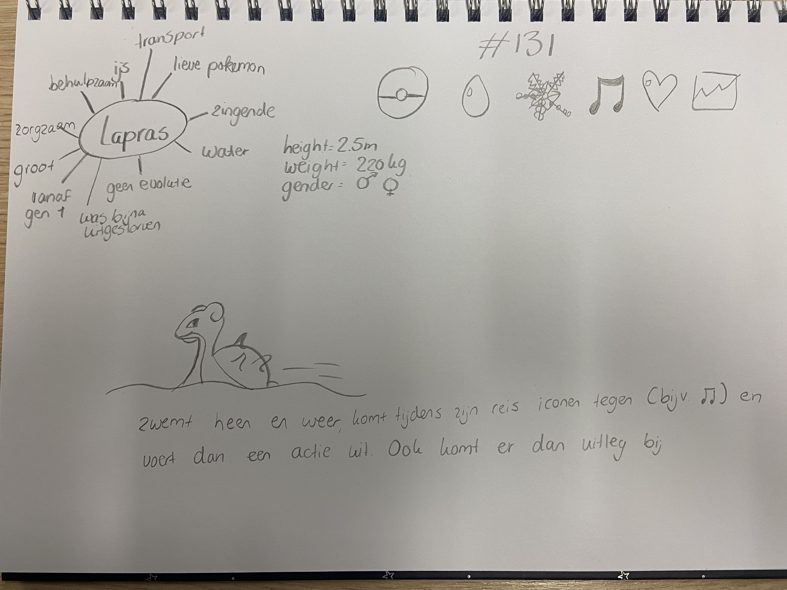
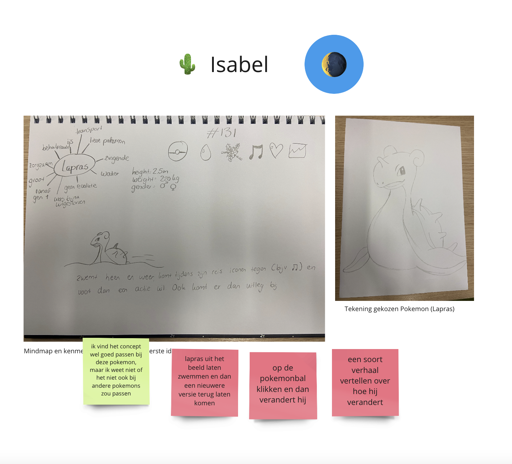

# Procesverslag
Markdown is een simpele manier om HTML te schrijven.  
Markdown cheat cheet: [Hulp bij het schrijven van Markdown](https://github.com/adam-p/markdown-here/wiki/Markdown-Cheatsheet).

Nb. De standaardstructuur en de spartaanse opmaak van de README.md zijn helemaal prima. Het gaat om de inhoud van je procesverslag. Besteedt de tijd voor pracht en praal aan je website.

Nb. Door *open* toe te voegen aan een *details* element kun je deze standaard open zetten. Fijn om dat steeds voor de relevante stuk(ken) te doen.

## Jij

### Ontwerper:
Isabel Worp

#### Je startniveau:
Mijn startniveau is: blauw

# Je plan

  
De eerste versie/schets van je ontwerp & je persoonlijke uitdaging

  ### De eerste versie/schets:
  

  ### Je ambitie: 
  Aan deze technieken/punten wil ik werken:
  - De code meer proberen te begrijpen
  - Meer proberen te experimenteren met verschillende ideeën
  - Met Javascript proberen te werken
  
 

## Voortgang/Feedback 1

  
Mijn bevindingen + wijzigingen (minimaal 5) met Mila

  ### Bevinding 1:
  Omschrijving van wat er nog niet orde was:
  Bij deze eerste feedback ronde had ik eigenlijk alleen nog maar een papieren schets. Op deze schets was mijn idee te zien:
  
  Wat er nog niet in orde was was voornamelijk mijn gedachte over hoe ik dit zou kunnen coderen, omdat dat niet mijn sterkste punt is. Het idee zelf vond ik erg leuk alleen wist ik niet hoe ik het moest aanpakken.

  #### oplossing:
  Beschrijving hoe je het hebt hebt opgelost of als het niet gelukt is hoe je het zou oplossen (tekst en afbeeding(en)).
  Ik heb het probleem opgelost om gewoon te beginnen met een background color en de zee te schetsen op mijn iPad. Zo had ik in ieder geval een start. Daarna deed ik alle afbeeldingen in mijn html zodat ik alle plaatjes voor me zag. Na hulp van u en van Rosella kwam ik er achter dat ik met Javascript moest gaan werken.

  ### Bevinding 2:
  Omschrijving van wat er nog niet orde was:
  Na de feebdack met Mila kreeg ik nog wat tips van haar. De rode post-its zijn tips of ideeën voor mijn Lapras site.
  
  

  #### oplossing:
  Mila kwam met het idee om op de Pokeball te drukken en de Lapras te laten veranderen. Mijn eerste idee was om de Lapras te laten veranderen als je op de Lapras zelf drukt, maar hij zwemt heen en weer dus dat is best lastig klikken. Ik heb dankzij Mila dus ervoor gekozen om op de Pokeball te drukken en dat de Lapras verandert naar de volgende generatie. 

  ### Bevinding 3:
  Ik kwam er achter dat de Lapras wel verandert met de jaren qua 'uiterlijk', maar niet hoe hij zich gedraagd. Lapras blijft vanaf generatie 1 t/m generatie 8 dezelfde Pokemon met dezelfde eigenschappen.

  #### oplossing:
  Mijn idee is om een aparte button toe te voegen met algemene informatie van Lapras, die dus niet verandert maar wel klikbaar blijft.

## Voortgang/Feedback 2

  
Mijn bevindingen + wijzigingen (minimaal 5) met Eva

  
  ### Bevinding 1:
  Omschrijving van wat er nog niet orde was (tekst en afbeeding(en)).

  #### oplossing:
  Beschrijving hoe je het hebt hebt opgelost of als het niet gelukt is hoe je het zou oplossen (tekst en afbeeding(en)).

  ### Bevinding 2:
  Omschrijving van wat er nog niet orde was (tekst en afbeeding(en)).

  #### oplossing:
  Beschrijving hoe je het hebt hebt opgelost of als het niet gelukt is hoe je het zou oplossen (tekst en afbeeding(en)).

  ### Bevinding 3:
  ...

## Voortgang/Feedback 3

  
Mijn bevindingen + wijzigingen (minimaal 5)

  
  ### Bevinding 1:
  Omschrijving van wat er nog niet orde was (tekst en afbeeding(en)).

  #### oplossing:
  Beschrijving hoe je het hebt hebt opgelost of als het niet gelukt is hoe je het zou oplossen (tekst en afbeeding(en)).

  ### Bevinding 2:
  Omschrijving van wat er nog niet orde was (tekst en afbeeding(en)).

  #### oplossing:
  Beschrijving hoe je het hebt hebt opgelost of als het niet gelukt is hoe je het zou oplossen (tekst en afbeeding(en)).

  ### Bevinding 3:
  ...

## Reflectie

  
Mijn eindresultaat & persoonlijke ontwikkeling

  ### Je uitkomst - karakteristiek screenshot(s):
  

  ### Dit ging goed/Heb ik geleerd: 
  Korte omschrijving met plaatje(s)

  

  ### Dit was lastig/Is niet gelukt:
  Korte omschrijving met plaatje(s)

  

## Bronnenlijst

continu bijhouden terwijl je werkt

Nb. Wees specifiek ('css-tricks' als bron is bijv. niet specifiek genoeg).

1. bron 1: Serebii.net. Link: https://www.serebii.net/pokedex-rs/131.shtml Foto's en informatie van en over Lapras.
2. bron 2: Wikipedia. Link: https://en.wikipedia.org/wiki/File:Poké_Ball_icon.svg Foto van Pokeball voor de button.
3. bron 3: Pagecloud. Link: https://www.pagecloud.com/blog/how-to-add-custom-fonts-to-any-website Bron voor font-face.
4. bron 4: Icons.com Link: https://icon-icons.com/icon/pokedex-pokemon-go-game/67530 Icoon Pokedex en Hartje met Pokemon.
5. bron 5: Pokefandom Link: https://pokemon.fandom.com/nl/wiki/Lapras Informatie over Lapras.
6. bron 6: Flaticon Link: https://www.flaticon.com/free-icon/music-note_43922 Muzieknoot icoon.

