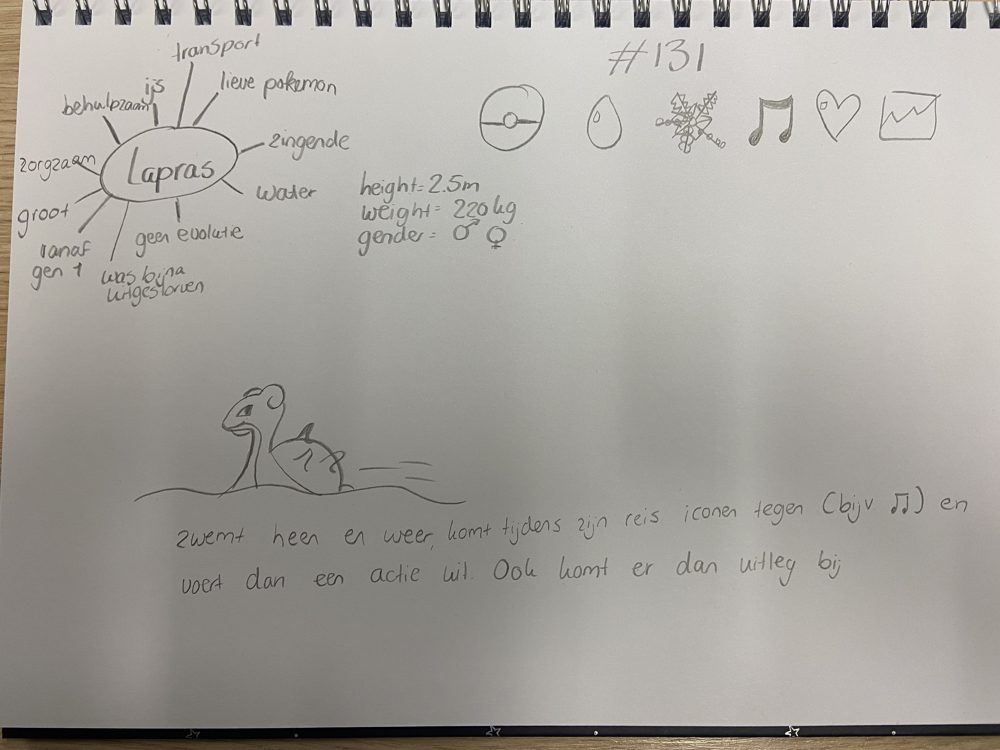
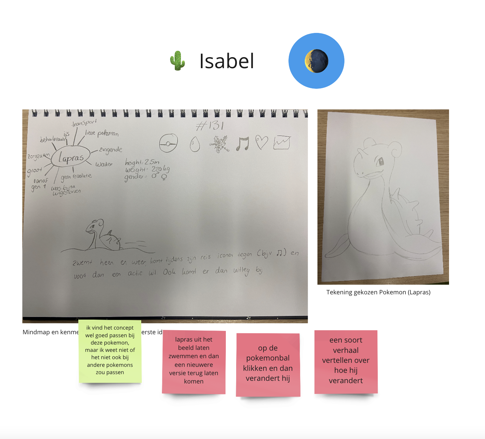
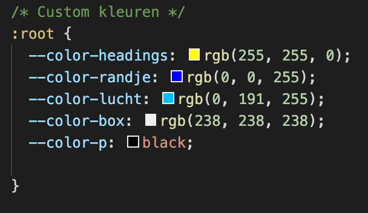
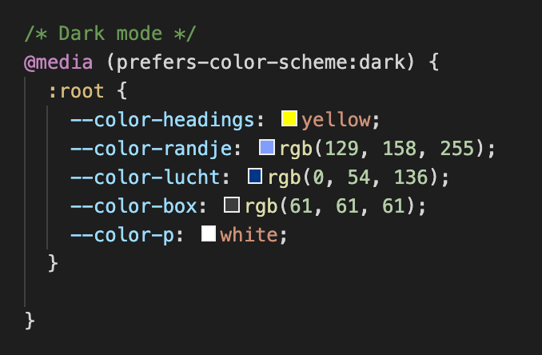
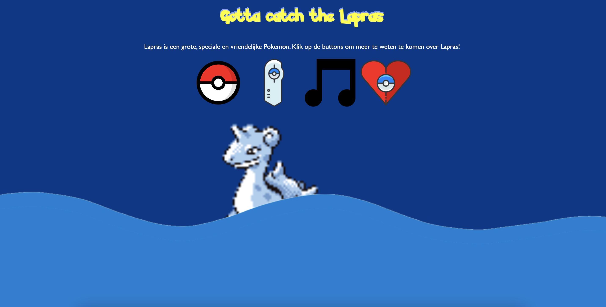
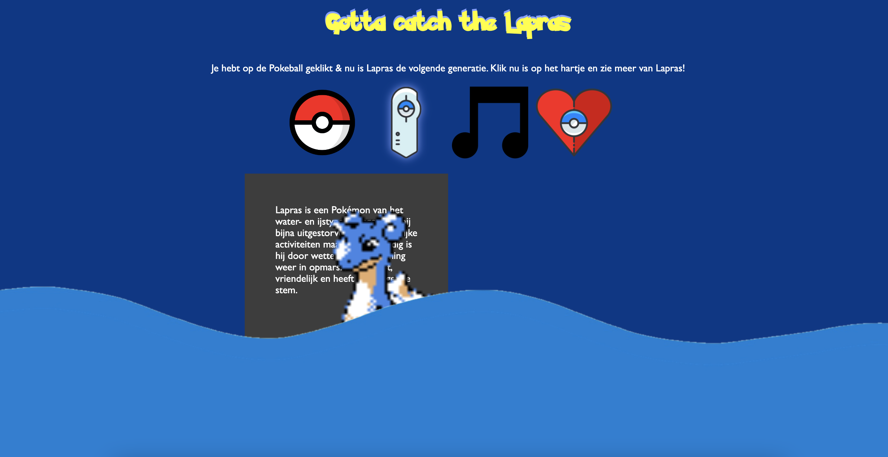
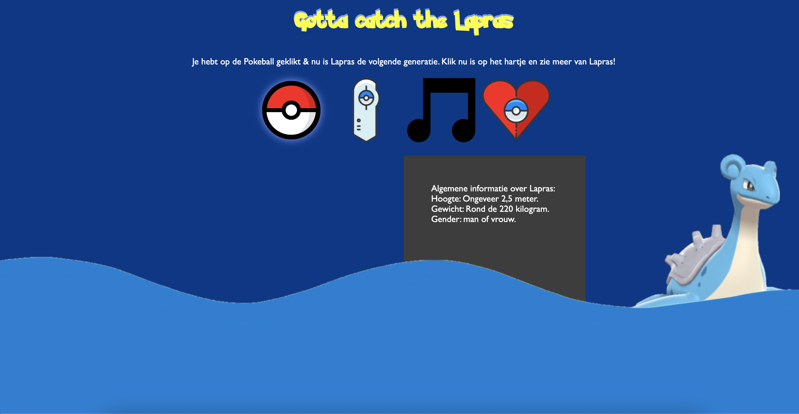

# Procesverslag

Markdown is een simpele manier om HTML te schrijven.  
Markdown cheat cheet: [Hulp bij het schrijven van Markdown](https://github.com/adam-p/markdown-here/wiki/Markdown-Cheatsheet).

Nb. De standaardstructuur en de spartaanse opmaak van de README.md zijn helemaal prima. Het gaat om de inhoud van je procesverslag. Besteedt de tijd voor pracht en praal aan je website.

Nb. Door *open* toe te voegen aan een *details* element kun je deze standaard open zetten. Fijn om dat steeds voor de relevante stuk(ken) te doen.

## Jij

### Ontwerper:
Isabel Worp

#### Je startniveau:
Mijn startniveau is: blauw

# Je plan

  
De eerste versie/schets van je ontwerp & je persoonlijke uitdaging

  ### De eerste versie/schets:
 

  ### Je ambitie: 
  Aan deze technieken/punten wil ik werken:
  - De code meer proberen te begrijpen
  - Meer proberen te experimenteren met verschillende ideeën
  - Met Javascript proberen te werken
  
 

## Voortgang/Feedback 1

  
Mijn bevindingen + wijzigingen met Mila

  ### Bevinding 1:
  Omschrijving van wat er nog niet orde was:
  Bij deze eerste feedback ronde had ik eigenlijk alleen nog maar een papieren schets. Op deze schets was mijn idee te zien:
  
  Wat er nog niet in orde was was voornamelijk mijn gedachte over hoe ik dit zou kunnen coderen, omdat dat niet mijn sterkste punt is. Het idee zelf vond ik erg leuk alleen wist ik niet hoe ik het moest aanpakken.

  #### Oplossing:
  Beschrijving hoe je het hebt hebt opgelost of als het niet gelukt is hoe je het zou oplossen:
  Ik heb het probleem opgelost om gewoon te beginnen met een background color en de zee te schetsen op mijn iPad. Zo had ik in ieder geval een start. Daarna deed ik alle afbeeldingen in mijn html zodat ik alle plaatjes voor me zag. Na hulp van u en van Rosella kwam ik er achter dat ik met Javascript moest gaan werken.

  ### Bevinding 2:
  Omschrijving van wat er nog niet orde was:
  Na de feebdack met Mila kreeg ik nog wat tips van haar. De rode post-its zijn tips of ideeën voor mijn Lapras site.
  
  

  #### Oplossing:
  Mila kwam met het idee om op de Pokeball te drukken en de Lapras te laten veranderen. Mijn eerste idee was om de Lapras te laten veranderen als je op de Lapras zelf drukt, maar hij zwemt heen en weer dus dat is best lastig klikken. Ik heb dankzij Mila dus ervoor gekozen om op de Pokeball te drukken en dat de Lapras verandert naar de volgende generatie. 

  ### Bevinding 3:
  Ik kwam er achter dat de Lapras wel verandert met de jaren qua 'uiterlijk', maar niet hoe hij zich gedraagd. Lapras blijft vanaf generatie 1 t/m generatie 8 dezelfde Pokemon met dezelfde eigenschappen.

  #### Oplossing:
  Mijn idee is om een aparte button toe te voegen met algemene informatie van Lapras, die dus niet verandert maar wel klikbaar blijft.

  ### Bevinding 4:
  Mila kwam ook met het idee om de Lapras uit beeld te laten zwemmen, ik ging wat proberen met Rosella.

  ### Oplossing:
  Ik wilde eerst dat de Lapras uit beeld zou zwemmen en dan ging veranderen, maar de Lapras moest ook draaien. Ik heb samen met Rosella uiteindelijk de Lapras laten draaien, we probeerde vanalles met onder andere scale en rotate. Na een uur proberen kwamen we eruit en zwom de Lapras heen en weer.

  ### Bevinding 5:
  Mila en ik kwamen nog op het laatste idee en dat was om Lapras te laten zingen. 

  ### Oplossing:
  Ik wilde dat als je op de Lapras klikte dat hij dan ging zingen, maar dat werkte niet dus daar ga ik later nog verder aan werken.

## Voortgang/Feedback 2

  
Mijn bevindingen + wijzigingen met Eva

  
  ### Bevinding 1:
  Omschrijving van wat er nog niet orde was (tekst en afbeeding(en)).
  Ik kwam erachter dat ik nog geen kleurenpallet had gemaakt. Dat is wel handig om te hebben zei Eva, dus die had ik op mijn lijstje gezet.

  #### Oplossing:
  Beschrijving hoe je het hebt hebt opgelost of als het niet gelukt is hoe je het zou oplossen:
  Ik heb een kleuren pallet gemaakt in css met variabelen.
  

  ### Bevinding 2:
  Omschrijving van wat er nog niet orde was (tekst en afbeeding(en)).
  Ook kwam ik er achter dat ik de hover en focus states van de buttons nog moet toepassen. 

  #### Oplossing:
  Beschrijving hoe je het hebt hebt opgelost of als het niet gelukt is hoe je het zou oplossen:
  Ik ben er nog niet aanbegonnen maar ik ga dat in de css oplossen met :hover, :active en :focus.

  ### Bevinding 3:
  Waar ik ook achter kwam is om bij belangrijke acties commentaar erbij te zetten. Dat zorgt voor duidelijkheid en structuur.

  ### Oplossing:
  Oplossing was simpel, meer commentaar schrijven bij mijn code, met // of met /*

  ### Bevinding 4:
  Eva gaf ook als tip om in je Javascript de functies en variabelen een toepasselijke naam te geven. Ik had bijvoorbeeld een opdracht vanuit de les gejat en in mijn code gezet, maar vergeten de button een andere naam te geven.

  ### Oplossing:
  Ik ging na de feedback meteen de namen veranderen van de variabelen veranderen zodat ik voor mezelf meer overzicht had.

  ### Bevinding 5:
  Ik was nog niet helemaal up to date met mijn bronnen in mijn code (wel in de bronnenlijst). het is zeker belangrijk om dat beter bij te houden omdat deze afbeeldingen niet van mij zijn.

  ### Oplossing:
  Ik heb de bronnen van de foto's in de code gezet dat ik de foto's daar vandaan heb.

  ### Bevinding 6:
  Als laatste tip kreeg ik de tip om dark mode toe te voegen, wat super simpel is om te doen en een leuke toevoeging is.

  ### Oplossing:
  Als oplossing heb ik het kleurenpallet gekopieerd en de kleuren aangepast.
   
  

## Voortgang/Feedback 3

  
Mijn bevindingen + wijzigingen met Stephanie

  
  ### Bevinding 1:
  Omschrijving van wat er nog niet orde was:
  Dit was het laatste feedback gesprek, dus bijna alles was al in orde. De eerste tip die ik nog kreeg is om een zingende lapras toe te voegen. Mila kwam bij de eerste feedback ronde daar ook mee maar dat was ik toen compleet vergeten.

  #### Oplossing:
  Beschrijving hoe je het hebt hebt opgelost of als het niet gelukt is hoe je het zou oplossen:
  Ik heb een button toegevoegd en die in javascript aangeroepen. Ik heb een eventlistener toegevoegd dat hij naar het klikken luisterde en een functie aan gemaakt. In de functie zette ik de tag audioplay() en als er op de button geklikt word gaat lapras zingen.

  ### Bevinding 2:
  Omschrijving van wat er nog niet orde was:
  Nog een tip, ik kreeg een idee om de tekst te laten veranderen als je op de Lapras drukt. 

  #### oplossing:
  Beschrijving hoe je het hebt hebt opgelost of als het niet gelukt is hoe je het zou oplossen.:
  Ik heb dit idee bij twee buttons toegevoegd, bij de Pokeball en de muzieknoot. Voor de andere twee buttons had ik geen tijd, omdat dat wat ingewikkelder werd omdat deze buttons ook te maken hebben met het tonen van andere tekst en daardoor ging alles door elkaar. Ik wist nog dat ik met het vak programmeren dat ook had gedaan dus ik heb in mijn javascript een variabele aangemaakt om de tekst aan te roepen, en in de functies van de button de textContent te gebruiken.

  ### Tot slot...
  Tijdens deze laatste feedback ronde hadden Stephanie en ik verder geen andere bevindingen meer naar elkaar.

## Reflectie

  
Mijn eindresultaat & persoonlijke ontwikkeling

  ### Je uitkomst - karakteristiek screenshot(s):
  
  
  

  ### Dit ging goed/Heb ik geleerd: 
  Ik ben trots op mezelf dat het coderen een stuk beter gaat. Begin van het vak vond ik het erg moeilijk maar nu ben ik lekker bezig. Heb nog wel veel hulp nodig maar van vragen leer je ook. Ik heb nogsteeds moeite met coderen maar ik merk dat het steeds beter gaat.

  

  ### Dit was lastig/Is niet gelukt:
  Ik kreeg soms veel stress van coderen. Tijdens de les als we samen aan het oefenen waren snapte ik vrijwel alles maar als je dan zelf aan de slag moet is het super lastig. Er zijn ook wat dingen waar ik helaas niet meer aan toe ben gekomen, namelijk:
  - tekst laten verschijnen en verdwijnen met welke generatie in beeld is
  - iets met shiny pokemon toevoegen
  - het transporteren van a naar b met de lapras

  De ideeën die ik had waren soms meer voor zwarte piste geweest of als ik coderen wel leuker vond, ik vind het prima, maar heb er zeker nog veel moeite mee. Maar ik ben zeker tevreden met het resultaat.

  

## Bronnenlijst

Continu bijhouden terwijl je werkt

1. bron 1: Serebii.net. Link: https://www.serebii.net/pokedex-rs/131.shtml Alle foto's en deels informatie van en over Lapras.
2. bron 2: Wikipedia. Link: https://en.wikipedia.org/wiki/File:Poké_Ball_icon.svg Foto van Pokeball voor de button.
3. bron 3: Pagecloud. Link: https://www.pagecloud.com/blog/how-to-add-custom-fonts-to-any-website Bron voor font-face.
4. bron 4: Icons.com Link: https://icon-icons.com/icon/pokedex-pokemon-go-game/67530 Icoon Pokedex en Hartje met Pokemon.
5. bron 5: Pokefandom Link: https://pokemon.fandom.com/nl/wiki/Lapras Informatie over Lapras.
6. bron 6: Flaticon Link: https://www.flaticon.com/free-icon/music-note_43922 Muzieknoot icoon.
7. bron 7: Reddit Link: https://www.reddit.com/r/respectthreads/comments/54w917/respect_ashs_lapras_pokemon_anime/ Lapras verdrietig.
8. bron 8: Fandomspot Link: https://www.fandomspot.com/lapras-nicknames/ Blije Lapras.

